  

  

<h3 align="center">
  Full-Stack Developer | ML & AI Enthusiast | CSE Student
</h3>

  

---

## 👨‍💻 About Me

I'm a Computer Science and Engineering student and a passionate developer interested in building practical and user-focused software solutions.

I enjoy working with modern web technologies and exploring Machine Learning, Artificial Intelligence, and Cybersecurity. I like turning ideas into functional applications while continuously improving my problem-solving and development skills.

- 🎓 Computer Science & Engineering student
- 💻 Interested in Full-Stack Web Development
- 🤖 Exploring Machine Learning and Artificial Intelligence
- 🔐 Interested in Cybersecurity and ML Security
- 🚀 Enjoy building practical software projects
- 📚 Continuously learning new technologies and development practices

---

## 🚀 Currently

- 🌱 Exploring **React, Node.js, TypeScript, and modern Full-Stack Development**
- 🤖 Learning and experimenting with **Machine Learning & AI**
- 🔐 Exploring **Cybersecurity and ML Security**
- 🛠️ Building and improving **Full-Stack Web Applications**
- 📖 Strengthening my knowledge of **Software Engineering and Computer Science**

---

## 🛠️ Skills & Technologies

### 👨‍💻 Programming Languages

  
  
  
  
  
  

### 🌐 Frontend Development

  
  
  
  
  
  

### ⚙️ Backend Development

  

### 🗄️ Database

  
  

### 🤖 Machine Learning & Data

  
  
  
  

### 🔧 Tools & Design

  
  
  

---

## 📂 Featured Projects

### 🏥 SerialTrack

A real-time hospital queue management system designed to help patients track doctor queues and manage appointments.

**Tech Stack:** React · Node.js · Express · Socket.IO · NeDB · Tailwind CSS

🔗 **Live Demo:** [View Project](https://serialtrack-iota.vercel.app/)

🔗 **Repository:** [View Repository](https://github.com/Maidul-057/serialtrack)

---

## 📊 GitHub Statistics

<picture>
  <source media="(prefers-color-scheme: dark)" 
          srcset="https://raw.githubusercontent.com/Maidul-057/Maidul-057/output/github-contribution-grid-snake-dark.svg">
  <source media="(prefers-color-scheme: light)" 
          srcset="https://raw.githubusercontent.com/Maidul-057/Maidul-057/output/github-contribution-grid-snake.svg">
  
</picture>

 
  

  

---

## 🤝 Connect With Me

---

## 📫 Contact

- 📧 Email: **maidulislamzishan@gmail.com**
- 💼 LinkedIn: [Maidul Islam](https://www.linkedin.com/in/maidul-t2021331057/)
- 🌐 Portfolio: [My Portfolio](https://maidul-057.github.io/My_Portfolio/)
- 📄 Resume: [View Resume](https://drive.google.com/file/d/1cNI8PsZuB8WFoPh0UkSweYyp9aDew8sW/view?usp=sharing)

---

## ⚡ Fun Fact

> I can spend hours trying to fix something that nobody asked me to fix. 😄

---

  <i>Thanks for visiting my profile! Feel free to explore my repositories.</i>

